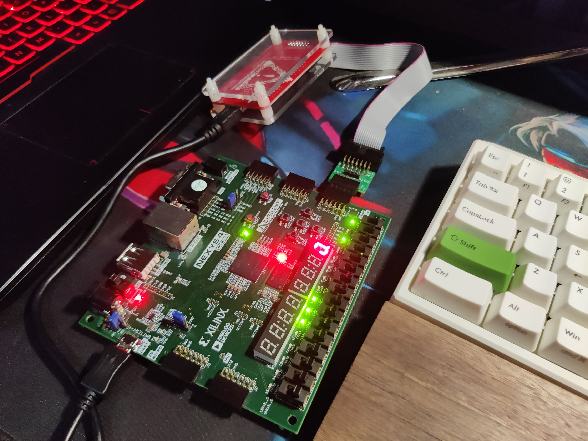

# nexys4-player
华中科技大学接口技术大作业

## 基于Bevy游戏引擎和FPGA的双人游戏
本项目是基于 [bevy](https://github.com/bevyengine/bevy) 游戏引擎编写的简单双人小游戏，通过键盘和 FPGA 板子上的按键分别控制两个角色的移动。  
FPGA 与主机通过串口进行消息通信。  
实现非常简单，功能非常残缺，玩法非常无聊，建议只作为 `bevy` 的学习参考。  

## 板子连接
  

## 游戏画面

