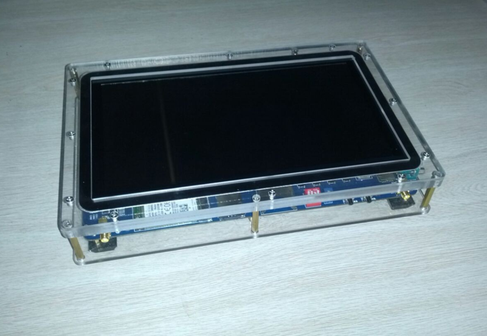
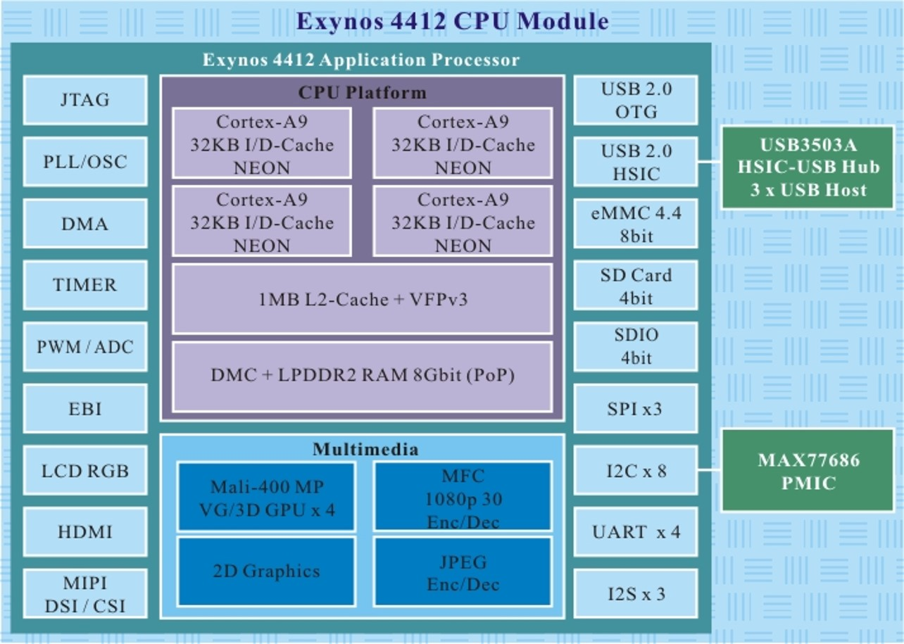
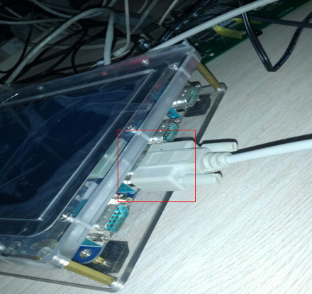
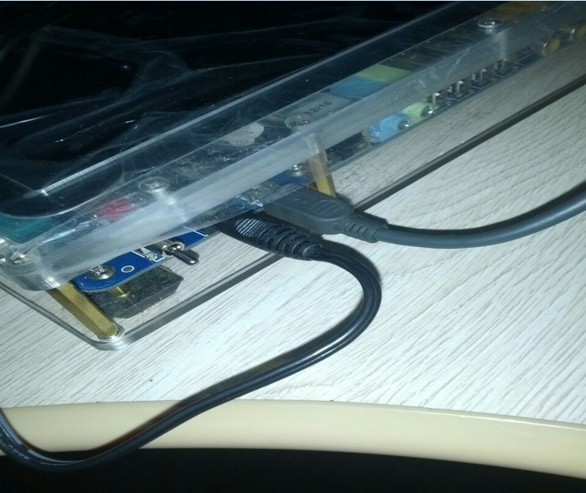
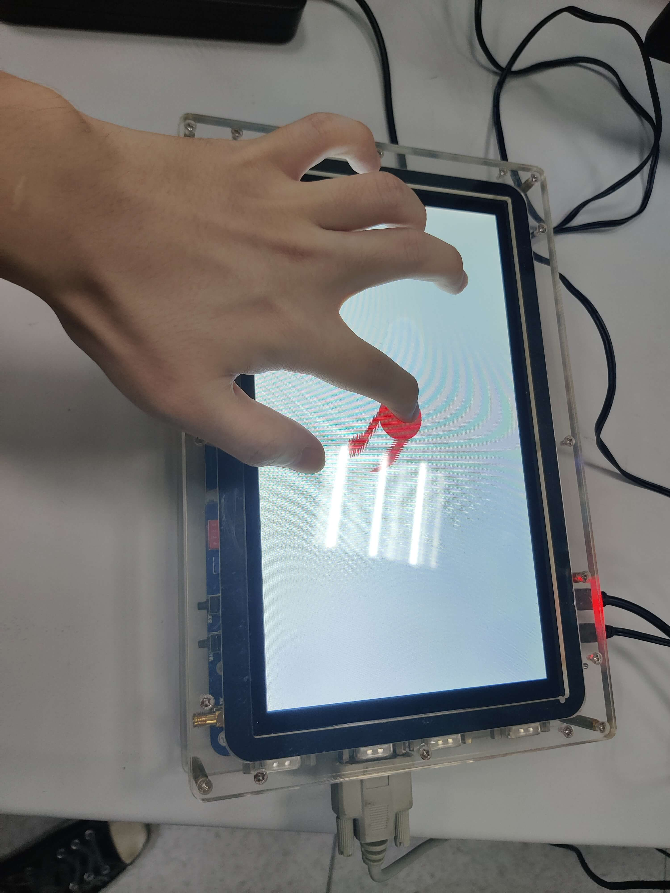
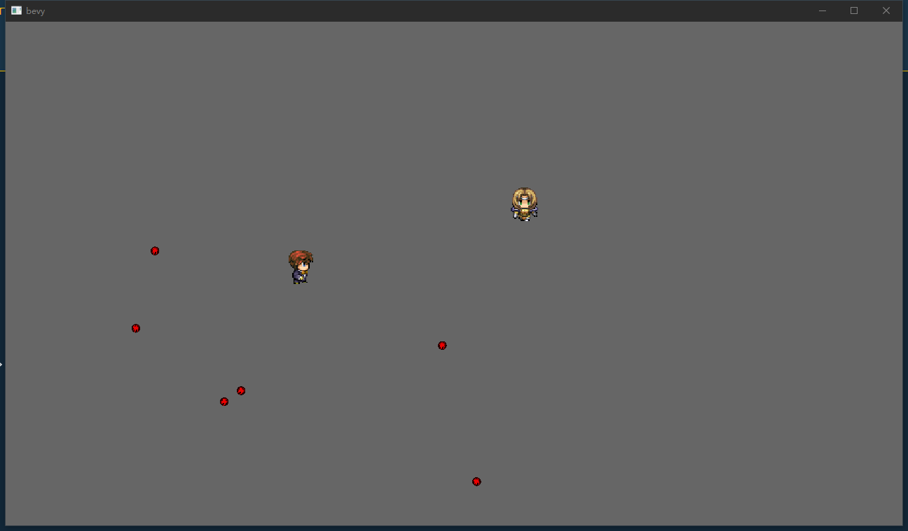

## 华中科技大学嵌入式实验报告
基于 ARM 开发板 和 Bevy 游戏引擎的双人射击小游戏。  

## 实验目的
* 了解基于 ARM 指令集的嵌入式开发的基本方法
* 熟悉硬件编程
* 培养软硬协同的系统观

## 实验内容
利用实验平台提供的开发板上的蓝牙功能，实现通过开发板的触屏对主机上游戏中的角色的控制，进而实现一个可以分别通过键盘和触屏控制角色的双人射击游戏。  

## 实验步骤
### 实验平台
* CPU：三星 Exynos 4412，4 核 A9，1.6 GHz
* GPU：ARM Mail-400MP，400 MHz
* 内存：2GB DDR3，1.6 GHz 带宽 64 位
* 外存：eMMC，4GB
* 屏幕：10.1 寸，1024 * 600
* 触摸屏：五点电容式触摸屏
* 其他：4 个 usb2.0 接口，4 个 uart 接口，网口，wifi，蓝牙，3g 模块

  

处理器架构：  
  


### Linux 系统烧录
实验平台已经配置好了交叉编译，系统烧写等环境，我们只需要按照文档操作就行了。  
首先编译 Linux Kernel 内核：  
```bash
cd /path/to/linux
make zImage
```
检查内核镜像是否生成成功：  
```bash
ls arch/arm/boot/zImage -al
```

接下来连接设备。  
串口一端连接开发板上左起第二个，另外一端连接 PC 机：  
  

USB 线一端连接开发板，另一端连接 PC：  
  

打开开发板电源，用 `cutecom` 工具打开串口：  
```
sudo cutecom
``` 
按下 `Open device` 按钮，即可连接上开发板的串口。  

在板子上按下重启键，然后在 cutecom 界面上按任意键，进入 `fastboot` 流程。  
烧写 Linux Kernel:  
```bash
sudo ./fastboot flash kernel zImage
```
烧写根文件系统：  
```bash
sudo ./fastboot flash ramdisk ramdisk-uboot.img
```
烧写主文件系统：  
```bash
sudo ./fastboot -w
sudo ./fastboot flash system system.img
```

重启开发板，直接进人刚刚烧写的 Linux 系统。烧写流程到此结束。  

### 蓝牙配置和连接
蓝牙是一种近距离，低速率，低功耗的无线通讯技术，可以用于实时语音传送和无线数据传送。  
运行启动脚本：  
```bash
./start_bt.sh
```
服务端运行蓝牙：  
```bash
rfcomm -r watch 0 1
```
然后可以就可以在 PC 端搜索到开发板上的蓝牙并且配对。  

### 开发板上运行的程序
实现思路：  
之前的实验四已经实现了开发板的触屏功能，并且可以记录前后两次手指的位置，并且绘制圆形。  
现在我们希望在次基础上添加新的功能：手指向上划的时候，控制 PC 端上的角色向上移动，向左向右还有向下类似。  
具体实现思路：  
* 记录每一次触屏事件手指的位置
* 手指移动时根据前后两次触屏事件手指的位置给 PC 端发送串口信息

`main.c` 代码：  
```C
#include <stdio.h>
#include "../common/common.h"

#define COLOR_BACKGROUND	FB_COLOR(0xff,0xff,0xff)
#define RED		FB_COLOR(255,0,0)
#define ORANGE	FB_COLOR(255,165,0)
#define YELLOW	FB_COLOR(255,255,0)
#define GREEN	FB_COLOR(0,255,0)
#define CYAN	FB_COLOR(0,127,255)
#define BLUE	FB_COLOR(0,0,255)
#define PURPLE	FB_COLOR(139,0,255)
#define WHITE   FB_COLOR(255,255,255)
#define BLACK   FB_COLOR(0,0,0)

static void send_serial(int x, int y, int ox, int oy);
static int bluetooth_fd;

static int touch_fd;
static int ox[5], oy[5];
static void touch_event_cb(int fd)
{
	int type,x,y,finger;
	type = touch_read(fd, &x,&y,&finger);
	switch(type) {
	case TOUCH_PRESS: {
		switch (finger)
		{
		case 0:
			fb_draw_circle(x, y, 50, RED);
			break;
		case 1:
			fb_draw_circle(x, y, 50, BLUE);
			break;
		case 2:
			fb_draw_circle(x, y, 50, YELLOW);
			break;
		case 3:
			fb_draw_circle(x, y, 50, GREEN);
			break;
		case 4:
			fb_draw_circle(x, y, 50, PURPLE);
			break;
		default:
			break;
		}
		fb_update_circle(x, y, 50);
		printf("TOUCH_PRESS：x=%d,y=%d,finger=%d\n",x,y,finger);
		break;
	}
	case TOUCH_MOVE: {
		// 把前一个圆清掉
		fb_draw_circle(ox[finger], oy[finger], 50, WHITE);
		switch (finger)
		{
		case 0:
			fb_draw_circle(x, y, 50, RED);
			break;
		case 1:
			fb_draw_circle(x, y, 50, BLUE);
			break;
		case 2:
			fb_draw_circle(x, y, 50, YELLOW);
			break;
		case 3:
			fb_draw_circle(x, y, 50, GREEN);
			break;
		case 4:
			fb_draw_circle(x, y, 50, PURPLE);
			break;
		default:
			break;
		}
		send_serial(x, y, ox[finger], oy[finger]);
		fb_update_two_circle(x, y, 50, ox[finger], oy[finger], 50);
		printf("TOUCH_MOVE：x=%d,y=%d,finger=%d\n",x,y,finger);
		break;
	}
	case TOUCH_RELEASE: {
		// 把前一个圆清掉
		fb_draw_circle(ox[finger], oy[finger], 50, WHITE);
		fb_update_two_circle(ox[finger], oy[finger], 100, ox[finger], oy[finger], 100);
		printf("TOUCH_RELEASE：x=%d,y=%d,finger=%d\n",x,y,finger);
		break;
	}
	case TOUCH_ERROR: {
		printf("close touch fd\n");
		close(fd);
		task_delete_file(fd);
		break;
	}
	default:
		return;
	}
	// fb_update();
	ox[finger] = x;
	oy[finger] = y;
	return;
}

static int bluetooth_tty_init(const char *dev)
{
	int fd = open(dev, O_RDWR|O_NOCTTY|O_NONBLOCK); /*非阻塞模式*/
	if(fd < 0){
		printf("bluetooth_tty_init open %s error(%d): %s\n", dev, errno, strerror(errno));
		return -1;
	}
	return fd;
}


int main(int argc, char *argv[])
{
	fb_init("/dev/graphics/fb0");
	fb_draw_rect(0,0,SCREEN_WIDTH,SCREEN_HEIGHT,COLOR_BACKGROUND);
	fb_update();

	//打开多点触摸设备文件, 返回文件fd
	touch_fd = touch_init("/dev/input/event3");
	//添加任务, 当touch_fd文件可读时, 会自动调用touch_event_cb函数
	task_add_file(touch_fd, touch_event_cb);
	
	//打开蓝牙设备
	bluetooth_fd = bluetooth_tty_init("/dev/rfcomm0");
	if(bluetooth_fd == -1) return 0;
	//task_add_file(bluetooth_fd, bluetooth_tty_event_cb);

	task_loop(); //进入任务循环
	return 0;
}

static void send_serial(int x, int y, int ox, int oy) {
	int obs_x = abs(x - ox);
	int obs_y = abs(y - oy);
	if(x < ox && obs_x > obs_y) {
		// 向左
		myWrite_nonblock(bluetooth_fd, "A", 1);
	}
	else if(x > ox && obs_x > obs_y) {
		// 向右
		myWrite_nonblock(bluetooth_fd, "D", 1);
	}
	else if(y > oy && obs_y > obs_x) {
		// 向上
		myWrite_nonblock(bluetooth_fd, "W", 1);
	}
	else if(y < oy && obs_y > obs_x) {
		// 向下
		myWrite_nonblock(bluetooth_fd, "S", 1);
	}
	else {}
}

```
### 主机游戏开发
主机游戏基于 Rust 语言开发的游戏引擎 [Bevy](https://github.com/bevyengine/bevy) 进行编写，分别通过键盘和开发板上的蓝牙进行角色控制。  
主机游戏通过蓝牙串口和开发板进行信息沟通，因此我们基于一个 Rust 语言的串口编程库 `serial-port` 来实现从蓝牙中获取串口信息的功能：  
```Rust
//! 串口数据传输
use serialport::Result;
use serialport::SerialPort;
use std::time::Duration;

/// 串口抽象
pub struct Nexys4Serial {
    pub port: Box<dyn SerialPort>,
}

unsafe impl Sync for Nexys4Serial {}

impl Nexys4Serial {
    /// 第一个可用的串口
    pub fn first_available(baud_rate: u32) -> Result<Self> {
        let ports = serialport::available_ports()?;
        let port = serialport::new(&ports[0].port_name, baud_rate)
            .timeout(Duration::from_millis(10))
            .open()?;
        Ok(Nexys4Serial { port })
    }

    /// 获得波特率
    #[allow(unused)]
    pub fn baud_rate(&self) -> u32 {
        self.port.baud_rate().expect("failed to get baud rate")
    }

    /// 设置波特率
    #[allow(unused)]
    pub fn set_baud_rate(&mut self, baud_rate: u32) {
        self.port
            .set_baud_rate(baud_rate)
            .expect("failed to set baud rate");
    }

    /// 读取一个字节
    ///
    pub fn read_one_byte(&mut self) -> Option<u8> {
        let mut buf = [0u8];
        self.port.read(&mut buf).map_or(None, |_| Some(buf[0]))
    }

    /// 写一个字节
    ///
    #[allow(unused)]
    pub fn write_one_byte(&mut self, byte: u8) -> Option<()> {
        let buf = [byte];
        self.port.write(&buf).map_or(None, |_| Some(()))
    }

    /// 读取串口数据到缓冲区
    /// 返回读取的字节数
    #[allow(unused)]
    pub fn read_to_buf(&mut self, buf: &mut [u8]) -> std::io::Result<usize> {
        self.port.read(buf)
    }

    /// 从缓冲区中写数据到串口
    #[allow(unused)]
    pub fn write_to_buf(&mut self, buf: &[u8]) -> std::io::Result<()> {
        self.port.write(buf)?;
        Ok(())
    }
}

```
这样子就可以实现蓝牙对角色控制的逻辑代码了：  
```Rust
/// 通过串口来控制 player1
fn serial_event_system(
    commands: &mut Commands,
    assets_mananger: Res<manager::AssetsManager>,
    mut query: Query<(&mut player::Player, &mut Transform, &mut TextureAtlasSprite)>,
) {
    let mut serial = SERIAL.lock().unwrap();
    if let Some(byte) = serial.read_one_byte() {
        // 取出第二个 player 对其进行控制
        let mut iter = query.iter_mut();
        let (_, _, _) = iter.next().expect("query empty");
        let (mut player, mut transform, mut sprite) = iter.next().expect("has no player1");
        match byte {
            BTN_U => {
                transform.translation.y += MAP_BLOCK_WIDTH;
                sprite.index = 9;
                player.toward = util::TOWARD::Up;
            }
            BTN_D => {
                transform.translation.y -= MAP_BLOCK_WIDTH;
                sprite.index = 0;
                player.toward = util::TOWARD::Down;
            }
            BTN_L => {
                transform.translation.x -= MAP_BLOCK_WIDTH;
                sprite.index = 3;
                player.toward = util::TOWARD::Left;
            }
            BTN_R => {
                transform.translation.x += MAP_BLOCK_WIDTH;
                sprite.index = 6;
                player.toward = util::TOWARD::Right;
            }
            BTN_C => {
                if player.toward == util::TOWARD::Up || player.toward == util::TOWARD::Down {
                    return;
                }
                let texture = assets_mananger
                    .textures
                    .get("buttle")
                    .expect("failed to find texture");
                let buttle = buttle::ButtleBuilder::type0(texture.clone());
                let material = assets_mananger
                    .materials
                    .get("red")
                    .expect("failed to find material");
                let mut buttle_transform = transform.clone();
                buttle_transform.scale.x /= 2.;
                buttle_transform.scale.y /= 2.;
                match player.toward {
                    util::TOWARD::Left => {
                        buttle_transform.translation.x -= PLAYER_SIZE;
                    }
                    util::TOWARD::Right => {
                        buttle_transform.translation.x += PLAYER_SIZE;
                    }
                    _ => panic!("impossiable!"),
                }
                let mut velocity = Velocity::default();
                if player.toward == util::TOWARD::Left {
                    velocity.translation *= -1.;
                }
                commands
                    .spawn(SpriteBundle {
                        sprite: Sprite {
                            size: buttle.size,
                            resize_mode: SpriteResizeMode::Manual,
                        },
                        material: material.clone(),
                        transform: buttle_transform,
                        ..Default::default()
                    })
                    .with(velocity)
                    .with(buttle::Buttle::new(0, 5));
            }
            _ => {}
        }
    }
}
```
### 联调
通过以下步骤进行最终联调：  
* 启动开发板，进入 Linux 系统
* 在开发板上的 Linux 系统上开启蓝牙服务
* PC 端配对蓝牙
* 在开发板上的 Linux 系统上运行交叉编译的 C 语言程序
* PC 端运行游戏程序
* 手指在开发板触摸屏上移动，观察主机上角色移动情况


## 成果显示
开发板：  
  
PC 端:  
  

## 小结
通过这次综合实验，我对之前 5 个实验的知识更加熟悉，对嵌入式软件开发的工具和方法更加熟练了。  
这一系列的实验让我对嵌入式开发有了初步认识，使得我对软硬协同的系统观有了更深一步的了解，激发了我对硬件编程的兴趣。  
希望如果将来我从事嵌入式开发的工作，在本次实验中学到的知识或技能可以派上用场。  
